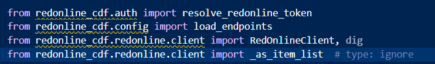

(base) PS C:\Users\CRANB1\Cursor\Cursor> pip install -r requirements.txt             

[notice] A new release of pip is available: 25.2 -> 26.2.1
[notice] To update, run: python.exe -m pip install --upgrade pip
ERROR: Could not open requirements file: [Errno 2] No such file or directory: 'requirements.txt'

3, in resolve_redonline_token
    raise RuntimeError(
RuntimeError: Set REDONLINE_API_KEY (or REDONLINE_TOKEN), or OAuth via REDONLINE_TOKEN_URL + REDONLINE_CLIENT_ID + REDONLINE_CLIENT_SECRET

(base) PS C:\Users\CRANB1\Cursor\Cursor\redonline-cdf-ingest> python scripts/discover_rol_schema.py
Calling list_sites...
  FAILED: RuntimeError: REDONLINE_BASE_URL is required when not in mock mode
Calling list_users_by_site...
  FAILED: RuntimeError: REDONLINE_BASE_URL is required when not in mock mode
Calling list_mapping_references...
  FAILED: RuntimeError: REDONLINE_BASE_URL is required when not in mock mode
Calling list_tasks_by_user...
  FAILED: RuntimeError: REDONLINE_BASE_URL is required when not in mock mode

  PS C:\Users\CRANB1\Cursor\Cursor\redonline-cdf-ingest> python scripts/discover_rol_schema.py
Calling list_sites...
  FAILED: ConnectError: [SSL: CERTIFICATE_VERIFY_FAILED] certificate verify failed: unable to get local issuer certificate (_ssl.c:1002)
Calling list_users_by_site...
  FAILED: ConnectError: [SSL: CERTIFICATE_VERIFY_FAILED] certificate verify failed: unable to get local issuer certificate (_ssl.c:1002)
Calling list_mapping_references...
  FAILED: ConnectError: [SSL: CERTIFICATE_VERIFY_FAILED] certificate verify failed: unable to get local issuer certificate (_ssl.c:1002)
Calling list_tasks_by_user...
  FAILED: ConnectError: [SSL: CERTIFICATE_VERIFY_FAILED] certificate verify failed: unable to get local issuer certificate (_ssl.c:1002)

